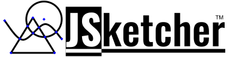

JSketcher
===========

JSketcher is a **parametric** 2D and 3D CAD modeler written in pure javascript

[YouTube Tutorial Video](https://www.youtube.com/watch?v=Vk3TTp8hNxQ&list=PLeoCiKHizvH8PZEyFvThHzVlnTF5XaL-R)

[Live Sample Demo](http://web-cad.org/?com.github.jsketcher-sample-models.MODELS.Flag-Holder)

[2D Sketcher](http://web-cad.org/sketcher.html#__sample2D__)

[Help Docs](./web/docs/index.md)

[Workbench Dev Guide](./dev-guide/index.md)

[Comercial Licencing](https://www.autodrop3d.com/parametric-cad-beta.html) 

Please consider supporting this project by becoming a backer
==============
<a href="https://opencollective.com/jsketcher-ad3d/"><image src="https://opencollective.com/jsketcher-ad3d/tiers/backer.svg?avatarHeight=300&width=3000"></image><image src="https://opencollective.com/jsketcher-ad3d/tiers/badge.svg"></image></a>

Current Status
==============

JSketcher is a parametric 3d modeler employing a 2D constraint solver for sketches and the feature/history metaphor to build models. The 2D constraint solver is completely written in javascript/typescript and is implemented in both the 3D CAD and the 2D sketcher. Originally developed by xibyte to make models for 3d printing. Today JSketcher provides a rich set of tools for visualizing, selecting/interacting with 3D geometry, tracking and storing model history all built on the foundation of the 2D sketcher engine and employing OpenCascade for solid modeling operations. 

Major Components and features
==============
* Geometric Constraint Solver. This is a most crucial component which allows to solve a system of geometric constraints applied to a sketch. 
  See below the list of supported constraints.
* 2D Sketcher. Allows to design 2d sketches applying geometric constraints. Uses HTML5 canvas for rendering.      
* 3D Boolean engine. OpenCascade is used to perform booleans on BREP objects.
* Feature History. Accumulates features builds a 3d model step by step. A compare step is employed to propagate edge/face IDs forward to provide a stable and robust model. 
* Export to **STL**, **DWG** and **SVG** formats
* Saving projects in the browser locale storage
* Repository of dimensions. For example if there is a line length constraint applied, it's not necessary to hardcode some length value. 
  A dimension with a symbolic name can be created and the constraint can refer to that dimension by name. 
  Once value of dimension gets changed the sketch is resolved again accordingly to the new dimension values.  
* 2D measurement tool. Allows adding dimensions on a 2D drawing(Linear, Vertical, Horizontal and Arc/Circle dimension are supported)
* No any server-side needed. Only client side Javascript and wasm. 

This modeler is already used for:

* Designing of 3d models to get them 3d-printed. 3D models are based on parametric 2d sketches. All models can be exported as an STL file and 3d-printed after.     
* Creating of 2d parametric sketches which could be exported to DWG or SVG format.   

Supported Constraints
=====================

* Coincident
* Vertical
* Horizontal
* Parallel
* Perpendicular
* Point to Line Distance
* Point to Object Distance
* Entity Equality(radius/length)
* Tangent
* Radius
* Point On Line
* Point On Arc / Ellipse
* Point In Middle
* Angle
* Symmetry
* Lock Convexity
* Fillet Meta Constraint

Get Started With the Code
=========================

Install node.js

* $ cd \<jsketcher folder\>
* $ npm install
* $ npm start

Contributing Please see  [.github/CONTRIBUTING.md ](.github/CONTRIBUTING.md )
=========================
