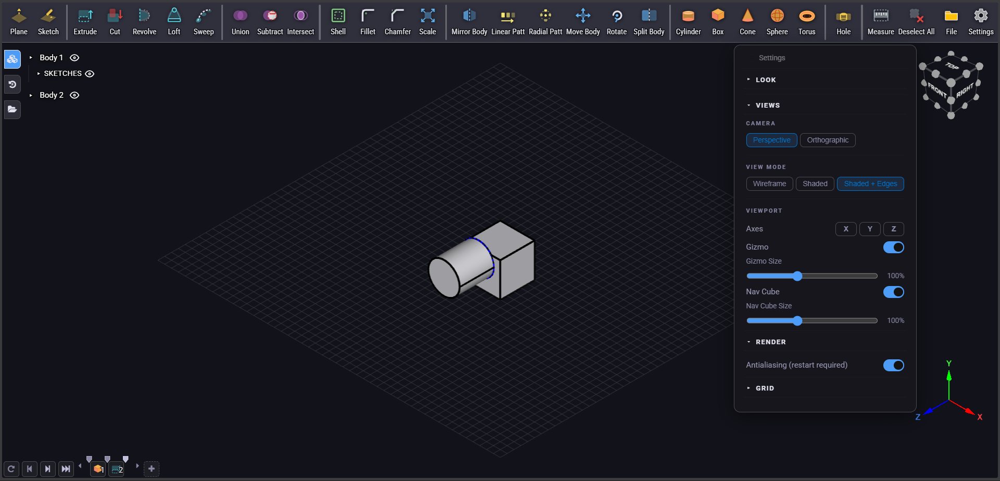
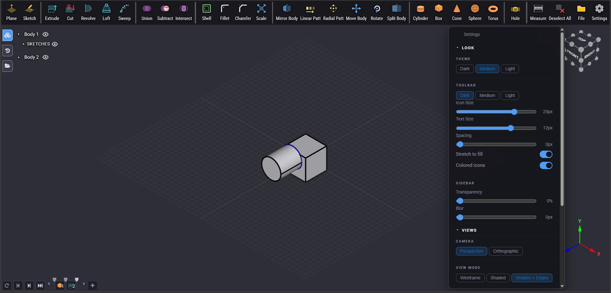
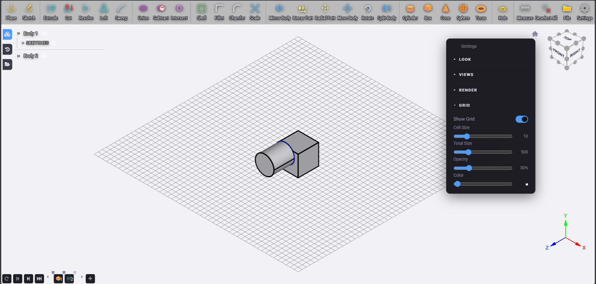
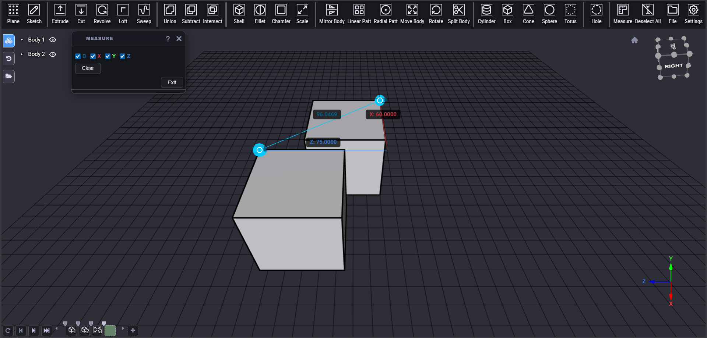

A simple, easy-to-use CAD application for solid modeling and sketching.

Built on [jsketcher](https://github.com/xibyte/jsketcher) by Autodrop3d LLC — see [LICENSE](./LICENSE) for terms.

<p align="center">
  
</p>
<p align="center">
  
  
  
</p>

## Features

### Solid Tools
- Extrude, Revolve, Loft, Sweep
- Boolean (union, subtract, intersect)
- Fillet & Chamfer (separate buttons)
- Shell, Hole, Scale Body
- Move Body & Rotate Body (with body center pivot option)
- Split Body (split a solid using another solid) NEEDS WORK
- Mirror Body, Linear Pattern, Radial Pattern
- Primitives: box, sphere, cylinder, cone, torus
- Measure Tool (Shapr3D-style snap points)

### UI 
- Scenes on left toolbar show sketches
- Dark / Medium / Light themes
- Colored/Monochrome Icons
- Top toolbar with all solid tools
- Left sidebar: Modifications, Scene tree, Projects
- NavCube (top right, with home button)
- Settings panel
- Floating panels over 3D viewport
- Project save/load via localStorage

## Running

```bash
npm install
npm start
# http://localhost:3000
```

## Key Files

| Area | File |
|------|------|
| Toolbar config | `modules/workbenches/modeler/index.ts` |
| Themes | `modules/ui/styles/theme.less` |
| Theme switcher | `web/app/cad/dom/components/SettingsPanel.jsx` |
| NavCube | `web/app/cad/dom/components/NavCube.tsx` |
| Sidebar | `web/app/cad/dom/components/FloatView.jsx` |
| Scene tree | `web/app/cad/craft/ui/ScenePanel.jsx` |
| Viewport | `web/app/cad/dom/components/View3d.jsx` |
| Measure | `modules/workbenches/modeler/actions/measure/measure.action.ts` |
| Split Body | `modules/workbenches/modeler/features/splitBody/splitBody.operation.ts` |
| Move/Rotate | `modules/workbenches/modeler/features/moveBody/` |
| OCC commands | `web/app/cad/craft/e0/occCommandInterface.ts` |
| BRep reading | `modules/brep/io/brepIO.ts` |
| Face rendering | `web/app/cad/scene/views/faceView.js` |
| Tess → Three.js | `web/app/cad/scene/views/viewUtils.js` |

## Known Issues & WASM Limitations

### Split Body tool  (WORK IN PROGRESS)

### Sphere / Curved Surface Tessellation

Spheres, cylinders, cones, tori look faceted. This is a **WASM binary limitation** — the C++ `Interrogate` function exports curved surfaces as `TYPE: 'UNKNOWN'` instead of B-SPLINE, giving JS no analytical surface data. Only a coarse triangle mesh (~306 tris for a sphere).

**What was tried and failed:**

| Approach | Result |
|----------|--------|
| `UpdateTessellation(ptr, deflection)` | Crashes — `RuntimeError: function signature mismatch` in WASM |
| `incmesh` OCC command before Interrogate | Runs but Interrogate ignores it |
| `nurbsconvert` then Interrogate | Conversion works but Interrogate still outputs `TYPE: 'UNKNOWN'` |
| `_SPI_tessellate` / engine.tessellate() | `_SPI_*` functions don't exist in this WASM binary |
| verb.js NURBS retessellation | Surface is NullSurface — no NURBS data available |
| Smooth normals on coarse mesh | Better shading but silhouette still faceted |

**What would fix it:**
1. **Recompile the WASM binary** — make `Interrogate` call `BRepBuilderAPI_NurbsConvert` before serialization so surfaces export as B-SPLINE
2. **Fix `_UpdateTessellation` C++ signature** to match JS binding
3. **JS-side mesh subdivision** — detect sphere-like faces, subdivide and project onto sphere. Most viable without touching C++

### Other WASM Issues
- `_SPI_*` functions are dead code — all work goes through `_CallCommand`
- Sphere edge curves are `CONIC` → `readCurve` returns `undefined` (fallback exists in `brep-tess.js`)
- `GenericWASMEngine_V1` is dead code

## Planned
- STL/STEP export with unit selector (mm/cm/m/inch)
- Electron packaging (Windows, Linux, Mac)
- More UI polish

## Contributing

Highest-impact areas:
1. **Fix sphere tessellation** — recompile WASM or implement JS subdivision
2. **Fix Split Body**
3. **STL/STEP export** — OCC kernel supports it
4. **Electron packaging** — wrap for desktop
5. **UI polish**

## License

Based on jsketcher by Autodrop3d LLC. See [LICENSE](./LICENSE) for full terms.
