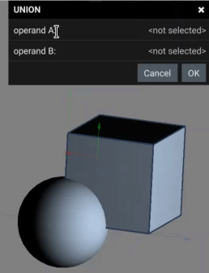
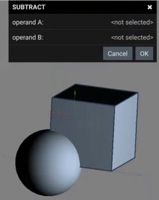
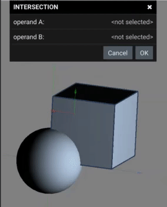

# BOOLEAN OPPERATIONS

Boolean operations allow for solids to be used as tools to shape and modify other solids.

# UNION
Union allows solids to be combined to create a new solid.

# SUBTRACT
Subtract allows one solid to be used as a cuttong tool for another sold. Usefull for making hole features.
Selection A will have selection B removed from it.

# INTERSECTION
Intersection allows for the creation of a new solid in the space where 2 exising solids overlap. 

