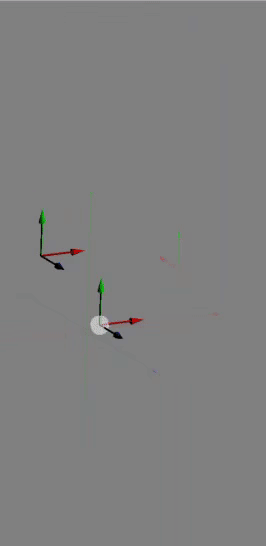

# BOX

The BOX command can be accesed by hovering over the center point of an existing datum and clicking. This brings up a menue with the BOX command as an option. 

Size of the box can be specified with the width, height and depth fields. 
The boolean drop down allows for boolean operations with existing 3d solids. See [BOOLEAN_OPPERATIONS.md](BOOLEAN_OPPERATIONS.md "BOOLEAN_OPPERATIONS.md").
