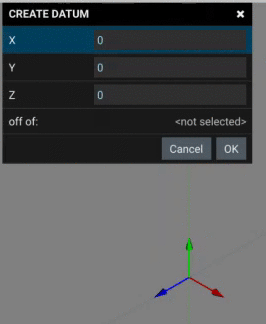

# Datum Create

While the CREATE DATUM dialog is open the datum can be dragged using the vector arrows. Optionally the values can be enter in the fields of the dialog. 

Datiums consist of a point and 3 vectors defining a relative location and orientation. The location and orientation can be moved after initial creation. See [DATUM_MOVE.md](DATUM_MOVE.md "DATUM_MOVE.md")
[DATUM_ROTATE.md](DATUM_ROTATE.md "DATUM_ROTATE.md")

The datium feature provides a point that can be used as the baisus for plane features or the origin point of a 3d primitive.

The datium feature also provides 3 vectors. These vectors can be used for defining a direction of an extride/cut or the acces of a revolve feature. 

