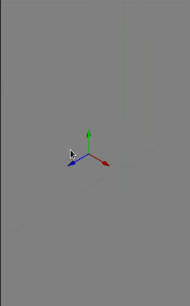

# Datum Move

The MOVE DATUM dialog can be accesed by hovering over the center point of an existing datum and clicking. This brings up a menue with the MOVE DATUM command as an option. 

While the MOVE DATUM dialog is open the datum can be dragged using the vector arrows. Optionally the values can be enter in the fields of the dialog. 

Optionally a new copy of the exisintg datum can be created rather than the translation of the original. 
