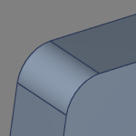
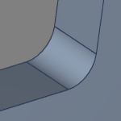

# Fillet Creation

Fillets can be applied to edges replacing the sharp edge with a rounded surface.
Multiple eges can be selected and the radius can be specified.

  
~~~
 .
~~~

On outside edges the fillet will trim material from the solid.

On inside edges the fillet will add material to the solid.

