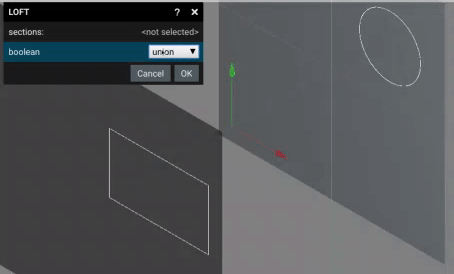

# Loft Creation

Loft allows for creation of a solid using 2 or more sketches on diferent plains.

For sketch creation see [Edit Face ](EditFace.md "EditFace.md")

Similar to an extrude. The loft operation will create a new solid.

The two sketches can be of diferent shapes. For example a rectangular shape can be used on one and a cicular shape on the other.

The boolean drop down allows for boolean operations with existing 3d solids. See [BOOLEAN_OPPERATIONS.md](BOOLEAN_OPPERATIONS.md "BOOLEAN_OPPERATIONS.md").