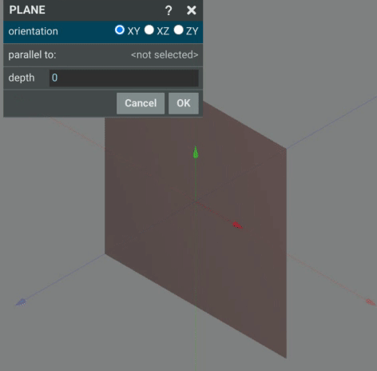
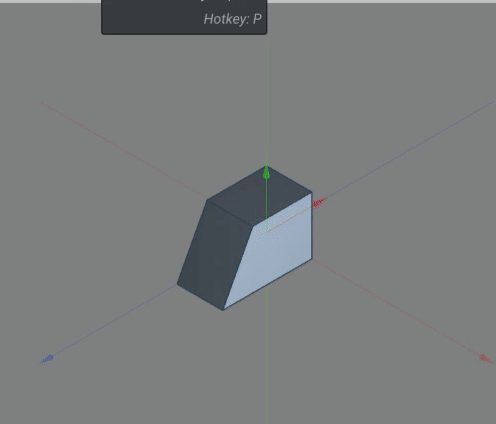

# Plane

The create plane command creates a plane that 2d sketchets can be drawn on.
You can select the orientation of the plane by selecting from the orientation options. 
~~~
 .
~~~

Planes can be created parrallel to an existing surface. 