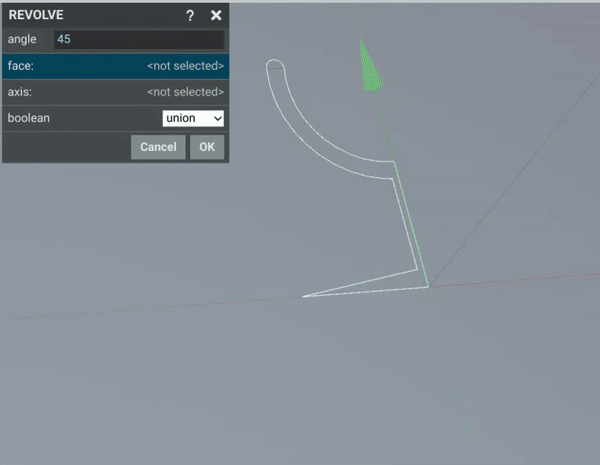
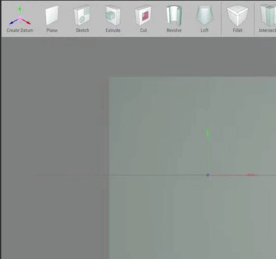

# Revolve

The revolve command consumes a sketch and allows it to be revolved arround a center line. An option angle is specified and it functions as a sweep centered arround a particular axis.

To start a revolve select an exisitng sketch and click the revolve icon from the tool bar. 
Then select a line to revolve about.
The angle of the revolve can be specified

