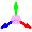
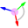
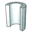
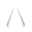
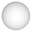

- [DATUM_CREATE.md](DATUM_CREATE.md "DATUM_CREATE.md")
- [DATUM_MOVE.md](DATUM_MOVE.md "DATUM_MOVE.md")
- [DATUM_ROTATE.md](DATUM_ROTATE.md "DATUM_ROTATE.md")
- [PLANE.md](PLANE.md "PLANE.md")
- [EditFace.md](EditFace.md "EditFace.md")
- [REVOLVE.md](REVOLVE.md "REVOLVE.md")
- [CUT.md](CUT.md "CUT.md")
- [FILLET.md](FILLET.md "FILLET.md")

- [ReassignSketch.md](ReassignSketch.md "ReassignSketch.md")

- [CYLINDER.md](CYLINDER.md "CYLINDER.md")
- [CONE.md](CONE.md "CONE.md")
- [SPHERE.md](SPHERE.md "SPHERE.md")
- [TORUS.md](TORUS.md "TORUS.md")

- [UNION.md](UNION.md "UNION.md")
- [SUBTRACT.md](SUBTRACT.md "SUBTRACT.md")
- [INTERSECTION.md](INTERSECTION.md "INTERSECTION.md")

- [StlExport.md](StlExport.md "StlExport.md")
- [Save.md](Save.md "Save.md")

- [index.md](index.md "index.md")
